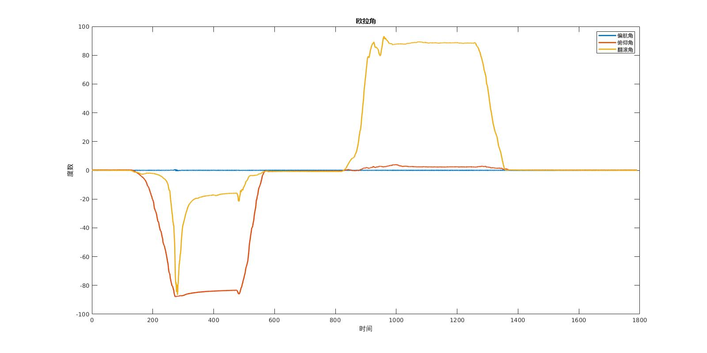

	2020年9月18日

1. 完成VG算法卡尔曼函数库的编写, 使用gcc编译成功, 但运行后发现输出有点奇怪, 后来通过gdb单步调试发现有一个变量在函数内声明后没有初始化, 经过修复, 输出结果跟之前使用Matlab仿真结果几乎没有差别. 均是使用相同的离线数据(csv格式), IMU先保持静止, 再旋转90度, 再静止, 再恢复到原来的姿态, 再旋转90度, 再静止, 再恢复到原来的姿态;

Fig.1 C 卡尔曼库离线结果

Fig.2 Matlab 卡尔曼库离线结果

2. 学习公司报销流程;

**待办事项** 
1. 报销在北京时候的消费;  
2. 将卡尔曼函数及其依赖的库烧写进芯片; 