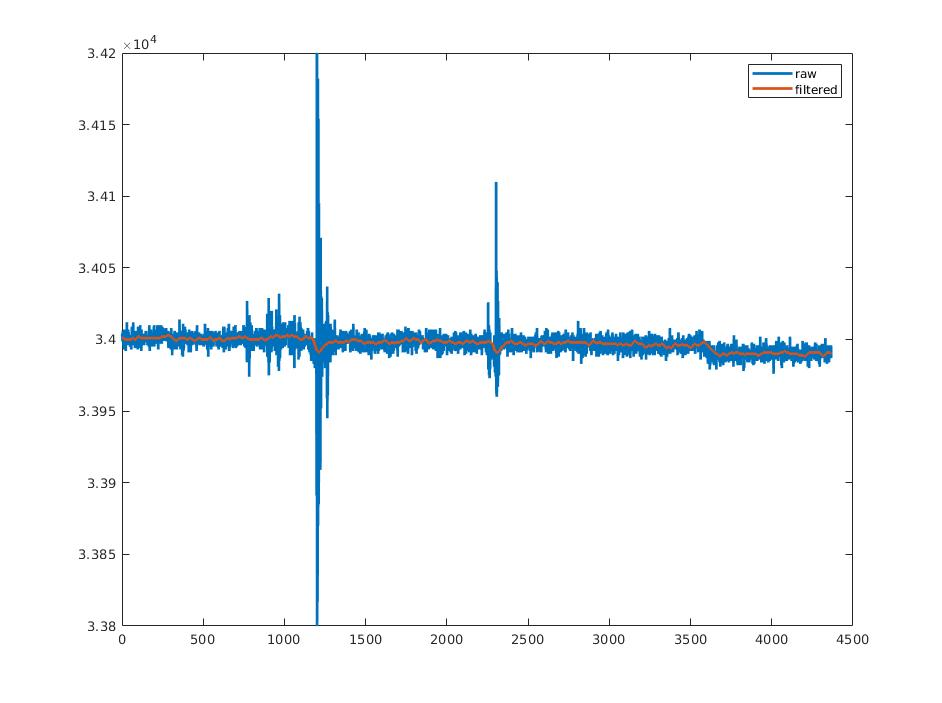

	2020年10月12日

1. 更改解包脚本, 读取IMU07帧数据, 对60阶FIR过滤后信号与未过滤信号进行对比，结果如图:

Fig.1 Matlab Raw Versus Fir 离线结果

Fir除了抑制了高频噪音, 还减缓了信号的突然变大或变小, 总体来说使信号的方差变小了, 但延迟还没办法估计到;  
2. 下午个人电脑windows更新把硬盘里系统的引导文件污染了, 无法开机, 修复了半天修好了, 但引导文件分区把windows文件所在的分区一分为二了, windows只剩下10GB空间, 等以后有时间划区重装windows;

**待办事项** 
1. 等待转台试验算法效果;